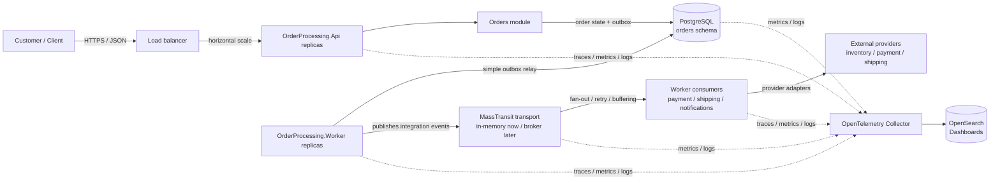

# Order Processing Platform

Compact architecture skeleton for an Order Processing Platform using .NET 10, EF Core 10, and PostgreSQL as the default database.

## Intent

Build a modular monolith first. Keep module boundaries clear, ship API and Worker as portable Docker images, and defer cloud/runtime choices until real constraints are known.

This skeleton is ready for a delivery team to pick up next day. The remaining work is intentionally listed as delivery backlog, not missing foundation work.

## Architecture



## Assumptions

- API handles synchronous HTTP work.
- Worker handles async integration and outbox work.
- Orders is the source of truth for order status, lifecycle, cancellation, and rejection.
- Catalog, Inventory, Pricing, Payments, and Shipping are capability boundaries behind the order workflow.
- PostgreSQL is the default persistence choice for this skeleton, not a hard platform constraint.
- The database outbox is the reliability boundary; a simple Worker relay moves records to the broker.
- MassTransit/broker is the async delivery and fan-out mechanism after the outbox relay.
- OpenTelemetry, GitHub Actions, Docker Compose, and Testcontainers are part of the foundation.
- Testcontainers-backed PostgreSQL tests run in CI with `RUN_TESTCONTAINERS=true`.

## Messaging Note

MassTransit is kept intentionally, but only on the async side. The API should persist order state and outbox records in the same database transaction. The Worker owns the outbox relay and publishes integration events through MassTransit so broker choice stays replaceable.

The skeleton uses in-memory MassTransit wiring. The production broker is selected later.

## API

```http
POST /orders
GET /orders/{orderId}
POST /orders/{orderId}/cancel
GET /orders/{orderId}/lifecycle
```

Inventory, pricing, payment, and shipping are internal boundaries for now. Add public endpoints only for user-facing workflows or provider callbacks.

## Modules

- `Orders`: aggregate, lifecycle, cancellation, persistence, outbox.
- `Catalog`: product identity and sellability contracts.
- `Inventory`: availability and future reservation contracts.
- `Pricing`: price, tax, and charge calculation contracts.
- `Payments`: authorization, future capture, and callbacks.
- `Shipping`: shipment initiation and tracking callbacks.

## Current Skeleton

- API and Worker hosts.
- Orders module with domain, persistence mapping, controller contract, and tests.
- Contract shells for Catalog, Inventory, Pricing, Payments, and Shipping.
- Dockerfiles, Docker Compose, GitHub Actions CI, OpenTelemetry setup, MassTransit Worker wiring, and Testcontainers-based integration tests.

## Scalability

No fixed request-per-second claim is made without load testing. The design is intended to scale by:

- running multiple API containers behind a load balancer
- scaling Worker containers independently for outbox relay and integration throughput
- scaling broker consumers when async integrations increase
- keeping the relational database as the first capacity bottleneck to monitor
- using indexes, connection pooling, idempotency, and optimistic concurrency around order writes
- moving slow provider calls behind async workflows when they do not need to block the caller

Before production, define target load and validate it with tests such as:

- peak `POST /orders` requests per minute
- order read traffic for `GET /orders/{orderId}`
- cancellation rate
- outbox dispatch latency
- provider timeout and retry behavior

## Backlog

1. Add command/query contracts for create, get, cancel, and lifecycle.
2. Add ports for inventory, pricing, payment, and shipping.
3. Implement a thin create-order path with deterministic fake adapters.
4. Add journey tests for success, rejection, retrieval, cancellation, and outbox persistence.
5. Implement a simple Worker outbox relay and MassTransit dispatch.

## Next-Day Pickup

The skeleton is ready for a delivery team to continue from the first vertical slice. The first developer task should be:

1. Keep the existing Orders endpoints.
2. Add `CreateOrderCommand` and handler inside the Orders module.
3. Add fake inventory, pricing, and payment ports.
4. Persist the order and outbox message in one transaction.
5. Replace the `POST /orders` placeholder with a real accepted/rejected response.

The other endpoints can remain placeholders until their slice starts.

## Delivery Notes

- Start with the Orders workflow; do not expand into microservices or extra public APIs yet.
- Add tests before each behavior slice, especially around order state transitions and persistence.
- Keep external systems behind ports and use deterministic fake adapters until real provider contracts are known.
- Persist order state and outbox messages in one transaction.
- Keep broker access behind MassTransit; business modules should not depend on broker SDKs.
- Keep module internals private unless another module or host genuinely needs a contract.
- Treat production runtime, identity, and observability backend as explicit decisions, not assumptions.
- Run restore, build, format, and tests before handing over changes.

## Decisions To Implement

- Identity: use OIDC/JWT bearer authentication. Use policy-based authorization with `orders:read`, `orders:create`, and `orders:cancel` scopes. Keycloak is the local/reference provider; a customer IdP can replace it later if it supports OIDC.
- Observability: the current skeleton uses console OpenTelemetry exporters. The target is OpenTelemetry Collector with OpenSearch and OpenSearch Dashboards as the default self-hosted observability store and UI. Elasticsearch is an acceptable alternative when the chosen distribution/license is approved.
- Inventory: use reservation, not validation-only. Creating an order reserves stock; cancellation releases the reservation when fulfillment has not started.
- Payment: authorize during order creation. Capture later from the Worker when fulfillment starts; cancellation before capture voids the authorization.

## Still Open

- Production runtime platform.
- Production MassTransit transport.
