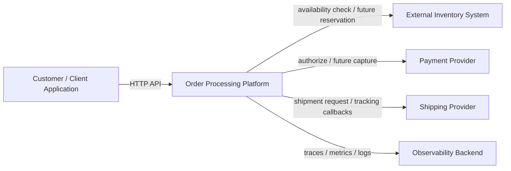
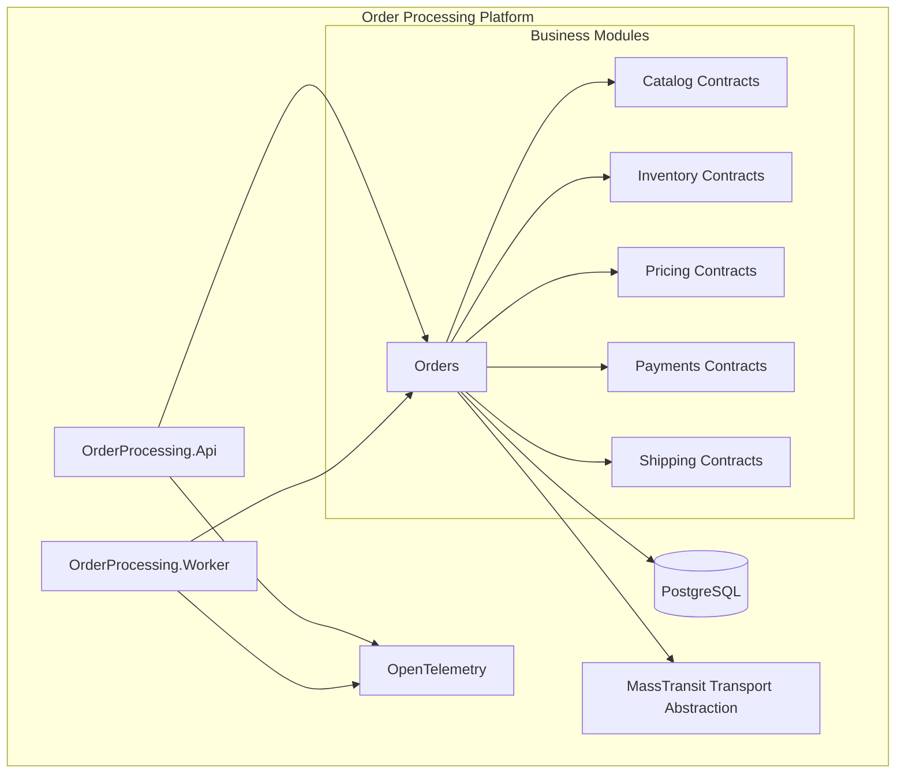
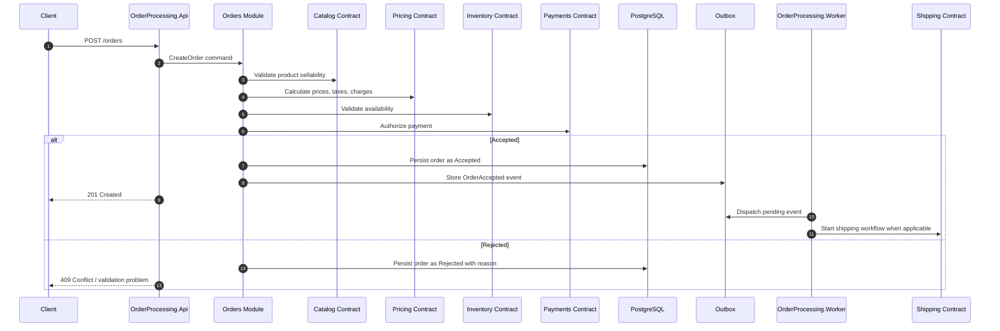
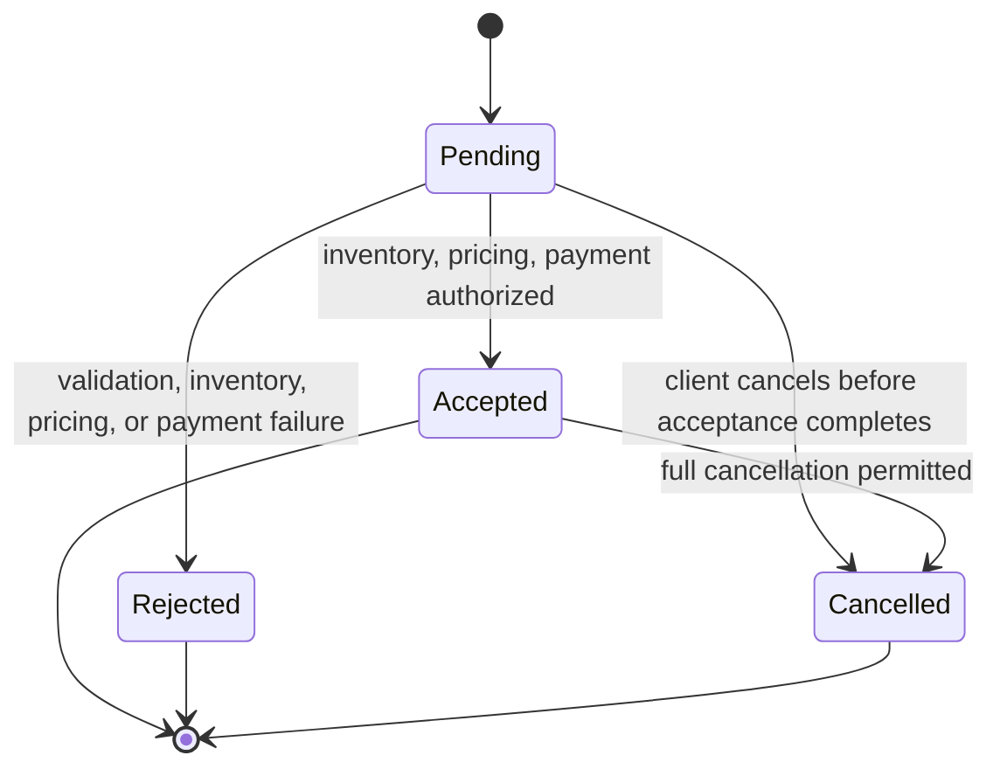
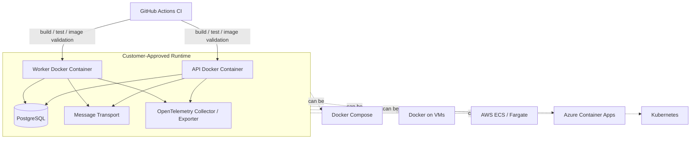

# Architecture Diagrams

These diagrams communicate the initial architecture at a level useful for implementation planning and interview discussion. They are intentionally cloud-neutral and focus on boundaries, flows, and deployment shape.

## 1. System Context

## 2. Modular Monolith Container View

## 3. Create Order Flow

## 4. Order Lifecycle

Initial lifecycle states are deliberately small: `Pending`, `Accepted`, `Rejected`, and `Cancelled`. Fulfillment-specific states can be added later when shipping ownership and provider behavior are confirmed.

## 5. Deployment Shape

The deployment contract is portable containers first. The production runtime, broker, and observability backend remain customer/environment decisions.
