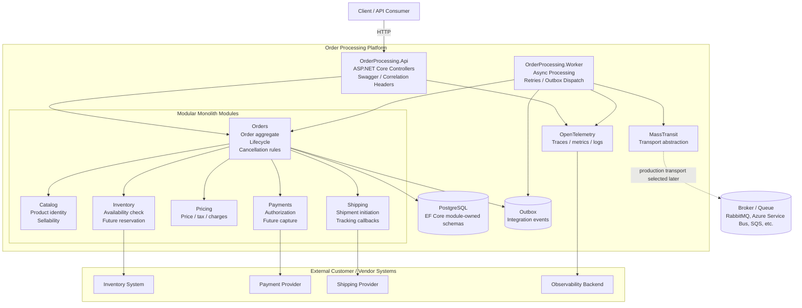
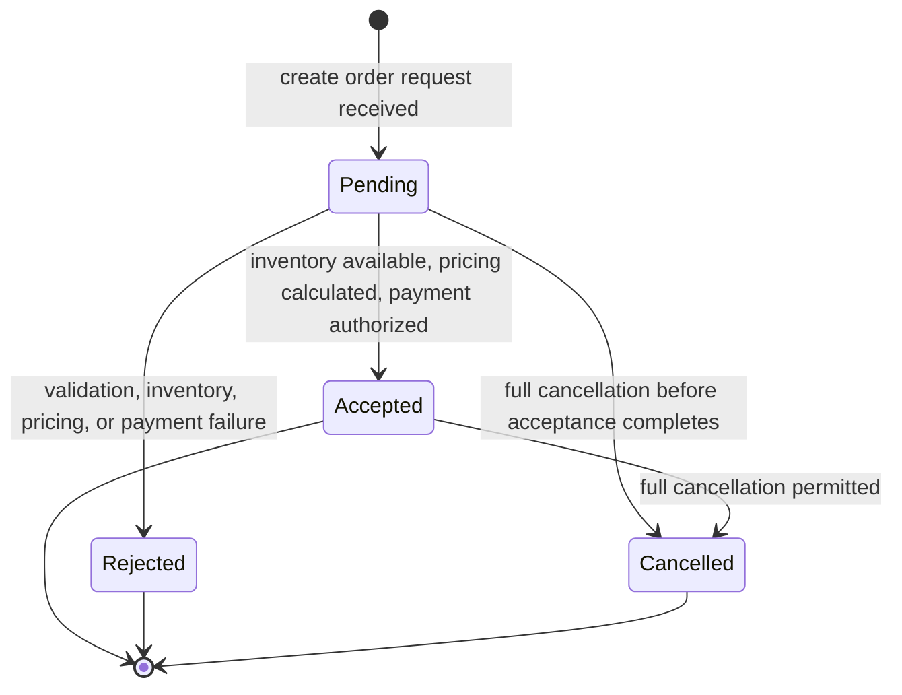

# Architecture Diagrams

These diagrams communicate the architecture at a level useful for implementation planning and interview discussion. They are intentionally cloud-neutral and focus on system boundaries, runtime shape, async processing, and order lifecycle rules.

## 1. System Design Overview

The platform starts as a modular monolith packaged into portable API and Worker containers. Module boundaries are explicit now, while broker choice, runtime platform, and observability backend remain replaceable customer/environment decisions.

## 2. Order Lifecycle

Initial lifecycle states are deliberately small: `Pending`, `Accepted`, `Rejected`, and `Cancelled`. Fulfillment-specific states can be added later when shipping ownership and provider behavior are confirmed.
